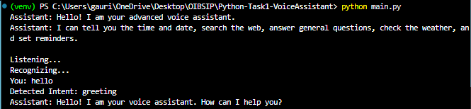
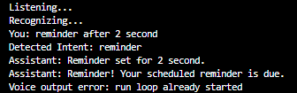
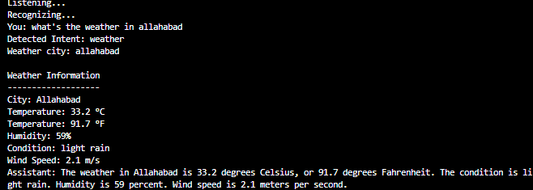
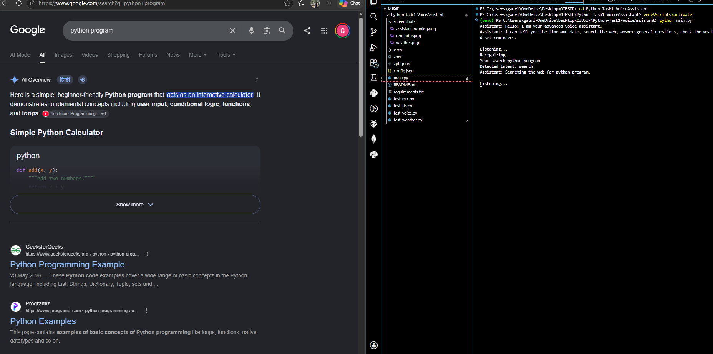

# 🎙️ Advanced Voice Assistant – OASIS INFOBYTE

## Task

Python Programming – Task 1

## Project Overview

This project is an advanced voice assistant developed using Python.

The assistant accepts voice commands from the user, converts speech into text, identifies the user's intent, performs the requested task, and responds using voice output.

The application is designed as a practical desktop voice assistant with features such as web search, weather information, date and time, reminders, and general knowledge queries.

---

## ✨ Features

- 🎙️ Voice command recognition
- 🔊 Text-to-speech responses
- 🕐 Current time
- 📅 Current date
- 🌐 Web search
- 🌦️ Weather information
- ⏰ Reminder functionality
- 🧠 General knowledge queries
- 📋 Intent detection
- 🔐 API key configuration through environment/configuration settings
- 🖥️ Simple command-line interface
- ❌ Graceful handling of unknown commands
- 🔄 Continuous listening until the user exits

---

## 🛠️ Technologies Used

- Python 3.11+
- SpeechRecognition
- pyttsx3
- Requests
- PyAudio
- Web browser
- OpenWeather API
- Knowledge/web lookup APIs

---

## 📁 Project Structure

```text
Python-Task1-VoiceAssistant/
│
├── screenshots/
│   ├── assistant-running.png
│   ├── reminder.png
│   ├── weather.png
│   └── web-search.png
│
├── .gitignore
├── main.py
├── config.json
├── requirements.txt
└── README.md
```

---

## ⚙️ Installation

### 1. Clone the repository

```bash
git clone https://github.com/Gauri2o/OIBSIP.git
```

### 2. Navigate to the Task 1 folder

```bash
cd OIBSIP/Python-Task1-VoiceAssistant
```

### 3. Create a virtual environment

```bash
python -m venv venv
```

### 4. Activate the virtual environment

Windows PowerShell:

```powershell
venv\Scripts\Activate.ps1
```

### 5. Install dependencies

```bash
pip install -r requirements.txt
```

---

## 🔑 Configuration

The weather feature requires an API key from OpenWeather.

The API configuration is stored separately from the main application logic.

Make sure the required API key is configured before using the weather feature.

Do not publish private API keys or other sensitive credentials on GitHub.

---

## ▶️ Run the Application

Start the assistant using:

```bash
python main.py
```

The assistant will greet the user and start listening for voice commands.

---

## 🎙️ Supported Commands

### Time

Example:

```text
"What is the time?"
```

The assistant provides the current time.

---

### Date

Example:

```text
"What is today's date?"
```

The assistant provides the current date.

---

### Weather

Example:

```text
"What's the weather in Allahabad?"
```

or:

```text
"Weather in Prayagraj"
```

The assistant retrieves weather information such as:

- Temperature
- Humidity
- Weather condition
- Wind speed

---

### Web Search

Example:

```text
"Search for Python programming"
```

The assistant opens a web search for the requested topic.

---

### Knowledge Query

Example:

```text
"What is Python programming?"
```

The assistant attempts to retrieve information and provide a spoken response.

---

### Reminder

Example:

```text
"Set a reminder"
```

The assistant can create reminders during the current application session.

---

## 🧠 Intent Detection

The assistant identifies different types of user requests before performing an action.

Supported intent categories include:

- Time
- Date
- Weather
- Web Search
- Knowledge
- Reminder
- Exit
- Unknown

This allows the assistant to route each voice command to the appropriate functionality.

---

## 🔊 Voice Response

The assistant uses text-to-speech technology to respond to the user.

Instead of displaying only text responses, the application converts the response into speech so that the interaction feels more natural.

---

## 🛡️ Error Handling

The application handles common situations such as:

- Speech not being recognized
- Unclear voice commands
- Unknown intents
- Invalid city names
- Weather API errors
- Missing or invalid API keys
- Network/API failures

When a command cannot be processed, the assistant provides an appropriate response instead of terminating unexpectedly.

---

## 📸 Screenshots

### Assistant Running



### Reminder



### Weather



### Web Search



---

## 🔐 Security

Sensitive API credentials should not be hard-coded into the source code.

The `.gitignore` file is used to prevent sensitive and unnecessary files such as virtual environments, cache files, and environment files from being committed to Git.

---

## 🚀 Future Enhancements

Possible future improvements include:

- GUI-based interface
- More voice commands
- Offline speech recognition
- More APIs and services
- News updates
- Music control
- Application launching
- Improved natural language understanding
- Persistent reminder management
- Multi-language voice support

---

## 🎯 Task Details

**Organization:** OASIS INFOBYTE

**Track:** Python Programming

**Task:** Task 1 – Voice Assistant

---

## 👩‍💻 Author

**Gauri Srivastava**

B.Tech – Computer Science and Engineering