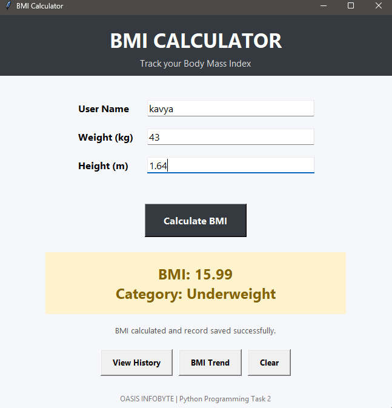
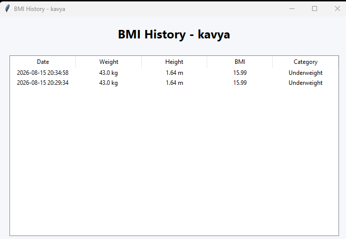
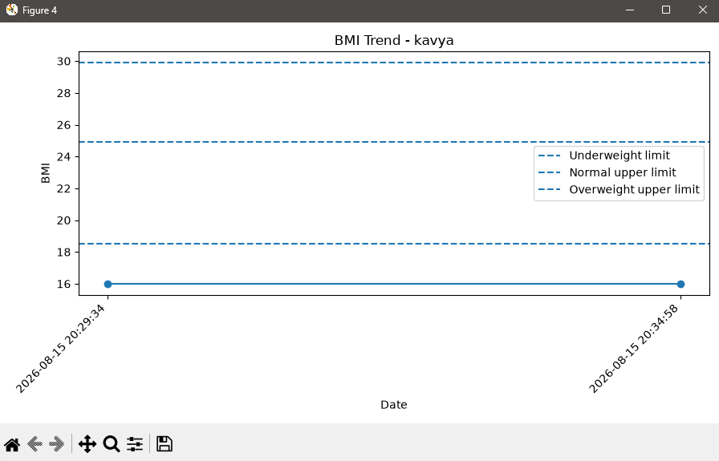

# ⚖️ BMI Calculator – OASIS INFOBYTE

## Task

Python Programming – Task 2

## Project Overview

This project is an interactive BMI (Body Mass Index) Calculator developed using Python.

The application allows users to enter their weight and height, calculates their BMI, displays the corresponding BMI category, and stores calculation history for later reference.

The project also provides a BMI trend visualization based on the saved calculation records.

---

## ✨ Features

- ⚖️ Calculate Body Mass Index (BMI)
- 📏 Supports height and weight input
- 📊 BMI category classification
- 🗃️ Stores BMI calculation history
- 📋 Displays previous BMI records
- 📈 BMI trend visualization
- 🔢 Displays BMI value with appropriate precision
- ❌ Input validation
- ⚠️ Handles invalid or incorrect inputs
- 🖥️ User-friendly interface
- 💾 SQLite database for storing calculation history

---

## 📊 BMI Categories

The calculator classifies BMI values into the following categories:

| BMI Range | Category |
|---|---|
| Below 18.5 | Underweight |
| 18.5 – 24.9 | Normal Weight |
| 25.0 – 29.9 | Overweight |
| 30.0 and above | Obesity |

> BMI categories are general screening ranges and are not a medical diagnosis.

---

## 🛠️ Technologies Used

- Python 3.11+
- SQLite
- Tkinter
- Matplotlib
- Python Standard Library

---

## 📁 Project Structure

```text
Python-Task2-BMICalculator/
│
├── screenshots/
│   ├── bmi-history.png
│   ├── bmi-trend.png
│   └── calculator-result.png
│
├── .gitignore
├── main.py
├── bmi.db
├── requirements.txt
└── README.md
```

---

## 🗃️ Database

The application uses SQLite to store BMI calculation records.

The database stores information such as:

- Weight
- Height
- BMI value
- BMI category
- Calculation date/time

The database file used by the application is:

```text
bmi.db
```

---

## ⚙️ Installation

### 1. Clone the repository

```bash
git clone https://github.com/Gauri2o/OIBSIP.git
```

### 2. Navigate to the Task 2 folder

```bash
cd OIBSIP/Python-Task2-BMICalculator
```

### 3. Create a virtual environment

```bash
python -m venv venv
```

### 4. Activate the virtual environment

Windows PowerShell:

```powershell
venv\Scripts\Activate.ps1
```

### 5. Install dependencies

```bash
pip install -r requirements.txt
```

---

## ▶️ Run the Application

Run:

```bash
python main.py
```

The BMI Calculator application will start.

---

## 🧮 BMI Calculation

BMI is calculated using the following formula:

```text
BMI = Weight (kg) / Height² (m²)
```

For example, if a person weighs 60 kg and has a height of 1.65 m:

```text
BMI = 60 / (1.65 × 1.65)
```

The application calculates the value automatically and displays the corresponding category.

---

## 🧪 Input Validation

The application validates user inputs before performing the calculation.

It handles:

- Empty input fields
- Non-numeric values
- Zero or negative height
- Zero or negative weight
- Invalid numerical input

Appropriate error messages are displayed when invalid data is entered.

---

## 📋 BMI History

The application stores previous BMI calculations in the SQLite database.

Users can view their previous records through the BMI history section.

The history helps users review their earlier calculations without manually recording them.

---

## 📈 BMI Trend

The application provides a BMI trend graph based on saved calculation records.

The graph helps users visually observe changes in BMI over multiple calculations.

---

## 📸 Screenshots

### Calculator Result



### BMI History



### BMI Trend



---

## 🔐 Data Storage

BMI records are stored locally using SQLite.

The application does not require an external database server.

The database file is:

```text
bmi.db
```

---

## 🚀 Future Enhancements

Possible future improvements include:

- User profiles
- BMI goal tracking
- Date-wise filtering
- Export history to CSV
- More detailed health statistics
- Responsive GUI design
- Unit conversion between metric and imperial systems
- Personalized BMI reports

---

## 🎯 Task Details

**Organization:** OASIS INFOBYTE

**Track:** Python Programming

**Task:** Task 2 – BMI Calculator

---

## 👩‍💻 Author

**Gauri Srivastava**

B.Tech – Computer Science and Engineering