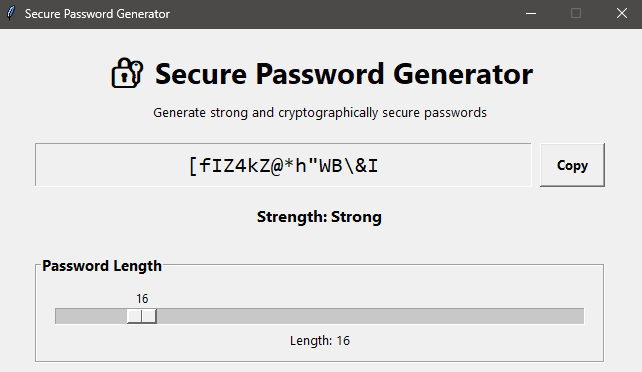
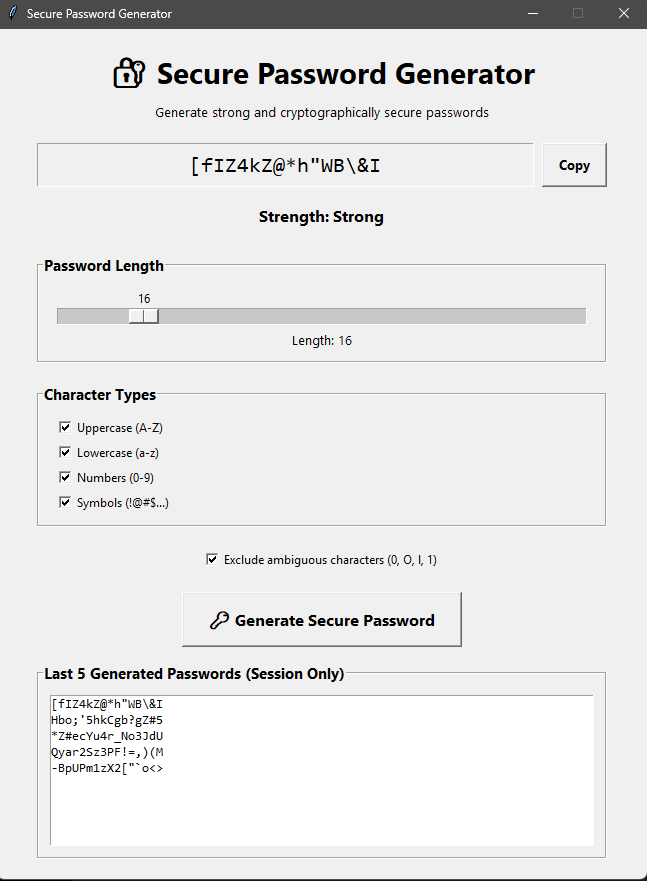
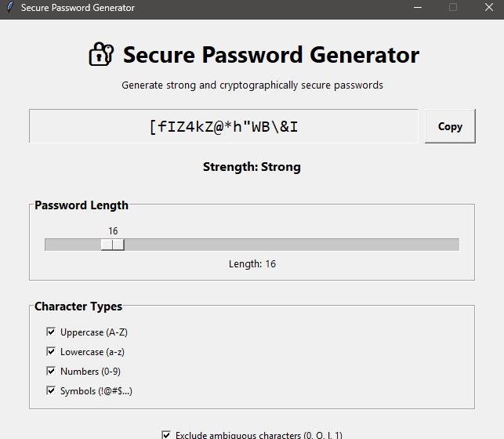

# 🔐 Secure Random Password Generator – OASIS INFOBYTE

## Task

Python Programming – Task 3

## Project Overview

This project is an advanced Secure Random Password Generator developed using Python and Tkinter.

The application generates strong and cryptographically secure passwords based on user-selected requirements.

The project uses Python's `secrets` module instead of the standard `random` module to provide stronger randomness suitable for password generation.

---

## ✨ Features

- Generate secure random passwords
- Adjustable password length from 8 to 64 characters
- Uppercase letters
- Lowercase letters
- Numbers
- Symbols
- Exclude ambiguous characters
- Password strength indicator
- Copy password to clipboard
- Automatic clipboard copy after generation
- Last 5 generated passwords displayed during the current session
- Input validation
- User-friendly Tkinter GUI
- No password history is permanently stored

---

## 🛠️ Technologies Used

- Python 3.11+
- Tkinter
- Secrets
- String
- Pyperclip

---

## 📁 Project Structure

```text
Python-Task3-RandomPasswordGenerator/
│
├── screenshots/
│   ├── password-generated.png
│   ├── password-history.png
│   └── password-options.png
│
├── .gitignore
├── main.py
├── requirements.txt
└── README.md
```

---

## 🔐 Security

The application uses Python's `secrets` module for secure password generation.

Unlike ordinary pseudo-random generation, `secrets` is designed for security-sensitive applications.

The generated password history is stored only in application memory during the current session.

Passwords are not permanently stored in a database or file.

---

## ⚙️ Installation

### 1. Clone the repository

```bash
git clone https://github.com/Gauri2o/OIBSIP.git
```

### 2. Navigate to the Task 3 folder

```bash
cd OIBSIP/Python-Task3-RandomPasswordGenerator
```

### 3. Create a virtual environment

```bash
python -m venv venv
```

### 4. Activate the virtual environment

Windows PowerShell:

```powershell
venv\Scripts\Activate.ps1
```

### 5. Install dependencies

```bash
pip install -r requirements.txt
```

---

## ▶️ Run the Application

Run the following command:

```bash
python main.py
```

The Secure Password Generator GUI will open.

---

## 🧪 Validation

The application validates:

- Minimum password length
- At least two character types
- Selected character categories
- Password generation requirements
- Clipboard operations
- Ambiguous character exclusion

If fewer than two character types are selected, the application displays an error message.

The minimum supported password length is 8 characters.

---

## 📋 Password History

The application displays the last 5 generated passwords during the current session.

The history is maintained only in memory.

It is not saved permanently to a database or file for security reasons.

When the application is closed, the session history is cleared.

---

## 💪 Password Strength

The application evaluates the generated password based on:

- Password length
- Uppercase characters
- Lowercase characters
- Numbers
- Symbols

The password strength is displayed as:

- Weak
- Medium
- Strong

---

## 📋 Copy to Clipboard

The generated password can be copied using the **Copy** button.

The application also automatically copies a newly generated password to the system clipboard.

---

## 📸 Screenshots

### Password Generated



### Password History



### Password Options



---

## 🎯 Task Details

**Organization:** OASIS INFOBYTE

**Track:** Python Programming

**Task:** Task 3 – Random Password Generator

**Tier:** Advanced

---

## 👩‍💻 Author

**Gauri Srivastava**

B.Tech – Computer Science and Engineering
